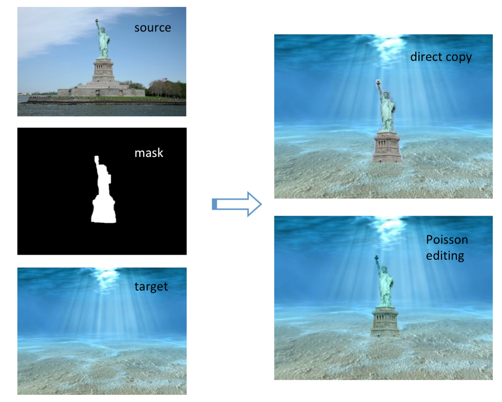
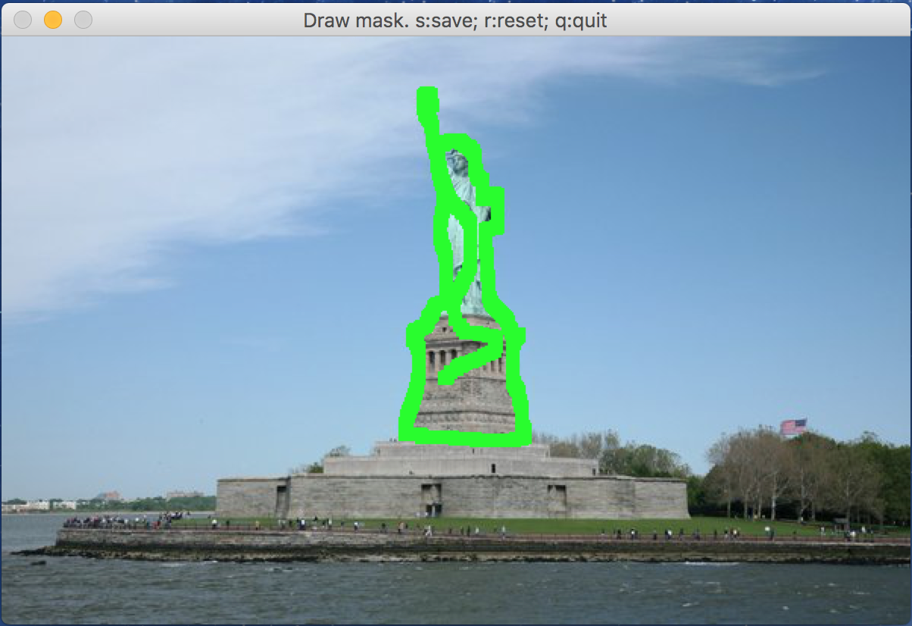
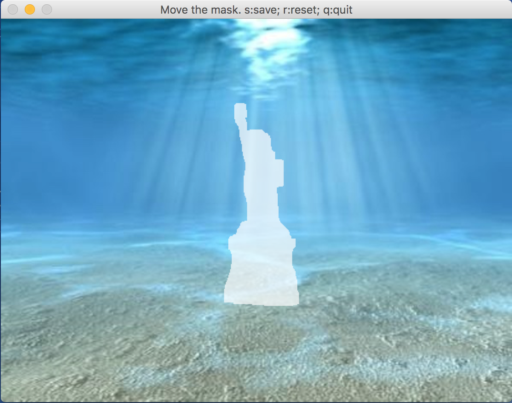

# Poisson Image Editing

This is a Python implementation of the [poisson image editing](https://www.cs.virginia.edu/~connelly/class/2014/comp_photo/proj2/poisson.pdf) paper to seamlessly blend two images. 



For example, I'd like to put the Statue of Liberty under the shinning ocean. The right side compares the results from direct copying and the Poisson image editing. 

In this [notebook](https://github.com/PPPW/poisson-image-editing/tree/master/poisson_image_editing.ipynb), I build the algorithm from scratch and explain each steps in detail. The code used in the notebook is extracted in the `*.py` files, you can also run it directly (see the next section for more instructions about how to run). 

## How to run

```
python main.py -s <source image> -t <target image> [-m <mask image>]
```

If the mask image is not specified, a window will pop up for you to draw the mask on the source image:



The green region will be used as the mask. Press `s` to save the result, press `r` to reset. 

After the mask is defined, a window will pop up for you to adjust the mask position on the target image: 



The mask corresponds to the region of source image that will be copied, you can move the mask to put the copied part into desired location in the target image. Press `s` to save the result, press `r` to reset. 

Then the Poisson image editing process will start. The blended image will be named as `target_result.png`, in the same directory as the source image. 


## Structure
Here's a brief description of each file's functionality:

* `main.py`: take command line argument and call `paint_mask.py`, `move_mask.py` and `poisson_image_editing.py`. 

* `paint_mask.py`: pop up a window for drawing the mask on the source image.

* `move_mask.py`: pop up a window for adjusting the mask location on the target image.

* `poisson_image.editing.py`: take source, target, mask image and mask offset, run the Poisson image editing algorithm for seamless image blending. 

* `poisson_image.editing.ipynb`: a notebook demonstrating the process. 
